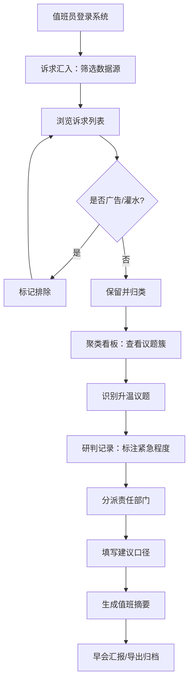

## 1. 产品概述

面向市级网信办值班人员的 Web 研判台系统，将每天从热线、政务留言板、短视频评论和本地论坛涌入的海量网民诉求自动归并为可处置的议题簇，辅助值班人员快速识别、研判和处置网络舆情。

- **目标用户**：市级网信办日常值班人员、舆情分析师
- **解决问题**：多渠道诉求分散难聚合、人工筛选效率低、舆情升温发现滞后、研判记录不规范
- **核心价值**：提升诉求处置效率 60% 以上，早会前 5 分钟掌握全网舆情态势

## 2. 核心功能

### 2.1 用户角色

| 角色 | 登录方式 | 核心权限 |
|------|----------|----------|
| 值班员 | 统一账号登录 | 诉求筛选、聚类浏览、研判标注、摘要生成 |
| 管理员 | 管理员账号 | 账号管理、系统配置、数据导出 |

### 2.2 功能模块

1. **诉求汇入页**：数据源筛选面板、诉求列表、内容详情预览、情绪与互动量展示
2. **聚类看板页**：主题卡片矩阵、扩散趋势图、涉事区域分布、代表性原帖
3. **研判记录页**：主题研判表单、紧急程度标注、责任部门分派、建议口径录入、值班摘要

### 2.3 页面详情

| 页面名称 | 模块名称 | 功能描述 |
|-----------|-------------|---------------------|
| 诉求汇入页 | 顶部筛选栏 | 时间范围选择（今日/昨日/近3天/自定义）、区域多远（行政区勾选）、平台多选（热线/政务留言板/短视频评论/本地论坛）、关键词搜索 |
| 诉求汇入页 | 诉求列表卡片 | 每条诉求显示：来源平台标识、发布时间（精确到分钟）、原文摘要（2行截断）、互动量（评论+点赞+转发）、情绪标签（正面/中性/负面，彩色徽章）、勾选框（用于排除广告/灌水） |
| 诉求汇入页 | 详情侧边栏 | 点击诉求卡片后展开，显示完整原文、完整互动数据、发布者信息（脱敏）、相似诉求推荐、快捷操作按钮（标记无关/加入关注） |
| 聚类看板页 | 统计概览条 | 今日诉求总量、已处置数量、升温议题数、待研判数量，数字配小趋势箭头 |
| 聚类看板页 | 主题卡片矩阵 | 每张卡片：主题名称（如"供暖不热"）、新增量数字、扩散速度条（绿黄红渐变）、涉及街道标签列表、代表性原帖摘要、紧急程度色条 |
| 聚类看板页 | 扩散趋势弹窗 | 点击卡片后弹出，显示 24 小时诉求量折线图、区域分布热力、相关平台占比饼图 |
| 研判记录页 | 待研判列表 | 左侧按紧急程度排序的主题列表，红色置顶 |
| 研判记录页 | 研判表单 | 紧急程度下拉（特急/紧急/一般/关注）、责任部门多选（含常用部门快捷标签）、建议口径富文本框、处置建议备注 |
| 研判记录页 | 值班摘要 | 一键生成一页摘要，包含：升温议题 TOP3、重点诉求、责任分工、建议口径，支持打印和导出 PDF |

## 3. 核心流程

值班员每日工作流程：登录系统 → 进入诉求汇入页，按条件筛选数据源 → 快速浏览并排除广告灌水内容 → 切换到聚类看板页，查看自动归并的主题卡片 → 重点关注扩散速度快、新增量大的议题 → 进入研判记录页，逐个标注紧急程度和责任部门 → 填写建议口径和处置建议 → 生成值班摘要供早会使用。

## 4. 用户界面设计

### 4.1 设计风格

**整体方向**：政务专业 + 高效冷峻风格，深色主题为主，适合长时间值班使用，减少视觉疲劳。

- **主色调**：深蓝 `#0F172A`（背景）、政务蓝 `#1E40AF`（主色）
- **辅助色**：危险红 `#DC2626`（紧急/负面）、警示橙 `#F59E0B`（升温/中性）、成功绿 `#059669`（平稳/正面）、信息紫 `#7C3AED`（平台标识）
- **中性色**：各种灰度层级，确保内容层次清晰
- **按钮风格**：直角微圆角（2px），政务风简洁按钮，按下有深度反馈
- **字体方案**：
  - 标题/数字：`Noto Sans SC` 字重 700，突出数据感
  - 正文/内容：`Noto Sans SC` 字重 400，提升长时间阅读舒适度
  - 数据展示：`JetBrains Mono` 等宽字体，用于互动量、时间戳
- **布局风格**：三栏式仪表盘布局，左侧导航固定，中部内容区可滚动，右侧为详情/操作区
- **图标风格**：线性简约图标（Lucide Icons），统一 2px 线宽
- **质感层次**：微玻璃态（backdrop-filter）用于浮动面板，卡片采用细腻阴影和 1px 内描边

### 4.2 页面设计概览

| 页面名称 | 模块名称 | UI 元素与交互 |
|-----------|-------------|-------------|
| 诉求汇入页 | 顶部筛选栏 | 深蓝色背景筛选条，下拉选择器带搜索，时间选择使用日期范围面板，区域/平台为可折叠分组复选框，筛选条件以标签形式实时显示在下方，点击可删除 |
| 诉求汇入页 | 诉求列表卡片 | 左对齐布局，卡片间 8px 间距，左侧彩色竖条标识情绪（红/灰/绿），平台图标彩色区分，互动量数字用等宽字体加粗，鼠标悬停卡片轻微上浮并高亮边框，勾选后卡片灰化 |
| 诉求汇入页 | 详情侧边栏 | 从右侧滑入（300ms 缓动），宽度 420px，顶部诉求标题大号字体，原文区滚动容器，底部固定操作按钮组，相似诉求以时间线形式排列 |
| 聚类看板页 | 统计概览条 | 4 个等宽数据卡片，每个含大数字、趋势迷你图、单位说明，数字变化有计数动画，趋势箭头用绿色向上/红色向下 |
| 聚类看板页 | 主题卡片矩阵 | CSS Grid 布局（桌面 3 列），每张卡片高度统一，顶部主题名称配图标，新增量数字大号配 "NEW" 角标，扩散速度为彩色渐变进度条，涉及街道以圆角小标签横向排列，代表性原帖区域浅灰底衬，卡片右上角紧急程度色块（红/橙/黄/蓝） |
| 聚类看板页 | 扩散趋势弹窗 | 居中 Modal，800px 宽，遮罩半透明深色，内嵌 ECharts 折线图（多色叠加）、区域条形图、平台占比环形图，图表切换使用标签页 |
| 研判记录页 | 待研判列表 | 左侧窄栏（280px），列表项左侧彩色圆点标识紧急程度，支持拖拽排序，已研判项显示勾选标记和浅底色 |
| 研判记录页 | 研判表单 | 表单字段垂直排列，紧急程度使用分段控制器（Segmented Control），责任部门为 Tag 输入框带自动补全，建议口径富文本支持常用模板插入，底部保存按钮固定 |
| 研判记录页 | 值班摘要 | 独立打印样式区域，A4 纸张比例，顶部系统标题和日期，分章节展示，行间距宽松，右侧悬浮工具条（打印/导出/复制） |

### 4.3 响应式设计

- **设计策略**：桌面端优先（Desktop-First），考虑值班人员主要使用 1920×1080 及以上分辨率显示器
- **断点适配**：
  - ≥1680px：三栏完整展示，聚类看板 4 列卡片
  - ≥1280px：标准三栏布局，聚类看板 3 列卡片
  - ≥1024px：两栏布局，详情栏改为弹窗形式，聚类看板 2 列
  - <1024px：单栏堆叠，导航收起为汉堡菜单
- **触控优化**：按钮最小点击区域 44×44px，移动端列表项增加垂直内边距

### 4.4 动效与交互

- **页面加载**：顶部进度条 + 内容区渐入（500ms）
- **卡片悬停**：transform: translateY(-2px) + 阴影加深（150ms ease-out）
- **筛选变化**：列表项交错淡入（staggered fade-in，30ms 间隔）
- **数据更新**：数字滚动计数动画（countUp），新内容顶部插入高亮闪烁
- **侧边栏/弹窗**：从右滑入 + 背景遮罩淡入（300ms cubic-bezier）
