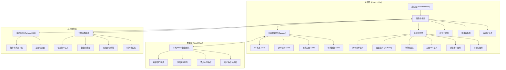
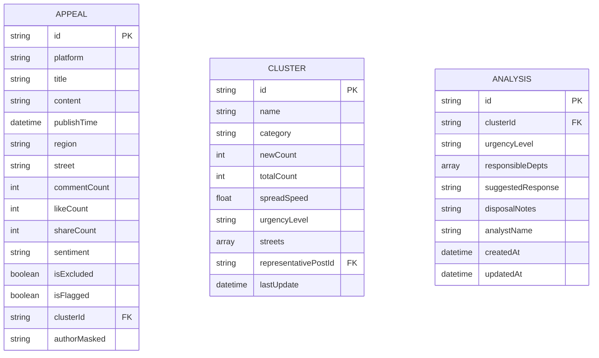

## 1. 架构设计



## 2. 技术说明

- **前端框架**：React 18 + TypeScript（强类型保障数据安全）
- **构建工具**：Vite 5（极速开发体验，HMR 毫秒级响应）
- **样式方案**：TailwindCSS 3 + CSS Variables（深色政务主题定制）
- **路由管理**：React Router v6（SPA 三页路由）
- **状态管理**：Zustand 4（轻量无样板，跨组件状态共享）
- **图表库**：ECharts 5（折线图/饼图/热力图/区域分布图）
- **图标库**：Lucide React（线性简约风格，2px 统一线宽）
- **富文本**：轻量 contentEditable 实现（建议口径编辑）
- **Mock 数据**：TypeScript 工厂函数生成真实感模拟数据
- **UI 组件**：自建组件库（不依赖重型 UI 库，保持政务风定制化）

## 3. 路由定义

| 路由路径 | 页面名称 | 页面说明 |
|----------|----------|----------|
| `/` | 诉求汇入页 | 默认首页，数据源筛选 + 诉求列表 + 详情预览 |
| `/cluster` | 聚类看板页 | 统计概览 + 主题卡片矩阵 + 扩散趋势弹窗 |
| `/analysis` | 研判记录页 | 待研判列表 + 研判表单 + 值班摘要生成 |

## 4. 数据模型

### 4.1 核心类型定义



### 4.2 数据枚举定义

```typescript
// 来源平台枚举
type Platform = 'hotline' | 'govMessage' | 'shortVideo' | 'localForum';

// 情绪类型枚举
type Sentiment = 'positive' | 'neutral' | 'negative';

// 紧急程度枚举
type UrgencyLevel = 'critical' | 'urgent' | 'normal' | 'attention';

// 时间范围枚举
type TimeRange = 'today' | 'yesterday' | 'last3days' | 'custom';

// 责任部门预设
const DEPARTMENTS = [
  '住建局', '城管局', '交通局', '教育局', '卫健委',
  '公安局', '环保局', '水务局', '民政局', '人社局',
  '市场监管局', '文旅局', '应急管理局', '政务服务中心'
];

// 行政区域预设（市级下辖区县/街道）
const DISTRICTS = [
  { name: '东城区', streets: ['朝阳街道', '建设街道', '和平街道', '解放街道'] },
  { name: '西城区', streets: ['人民街道', '胜利街道', '中山街道', '文化街道'] },
  { name: '南城区', streets: ['新华街道', '滨江街道', '东湖街道', '南山街道'] },
  { name: '北城区', streets: ['北城街道', '开发区街道', '工业园区街道', '新区街道'] },
  { name: '高新区', streets: ['科技街道', '创业街道', '学府街道'] }
];
```

## 5. 组件分层架构

### 5.1 目录结构

```
src/
├── assets/              # 静态资源（字体等）
├── components/          # 通用组件
│   ├── layout/         # 布局组件（Sidebar、Topbar）
│   ├── common/         # 基础 UI（Button、Badge、Tag、Modal）
│   ├── appeal/         # 诉求相关组件（AppealCard、FilterBar、DetailPanel）
│   ├── cluster/        # 聚类相关组件（ClusterCard、StatCard、TrendChart）
│   └── analysis/       # 研判相关组件（AnalysisForm、UrgencyPicker、DeptSelector）
├── pages/              # 页面级组件
│   ├── AppealPage.tsx
│   ├── ClusterPage.tsx
│   └── AnalysisPage.tsx
├── store/              # Zustand 状态管理
│   ├── useAppealStore.ts
│   ├── useClusterStore.ts
│   └── useAnalysisStore.ts
├── data/               # Mock 数据模块
│   ├── mockAppeals.ts
│   ├── mockClusters.ts
│   └── dictionaries.ts
├── types/              # TypeScript 类型定义
│   └── index.ts
├── utils/              # 工具函数
│   ├── formatters.ts
│   ├── filters.ts
│   └── exporters.ts
├── styles/             # 全局样式
│   └── globals.css
├── App.tsx
├── main.tsx
└── router.tsx
```

## 6. 性能与体验优化

- **虚拟滚动**：诉求列表超过 100 条时启用虚拟列表渲染
- **防抖优化**：筛选器输入、搜索关键词 300ms 防抖
- **按需渲染**：图表组件使用 `useMemo` 缓存计算结果
- **代码分割**：按页面级别进行路由懒加载
- **图表懒加载**：ECharts 按需引入核心模块（折线/饼/条形图）
